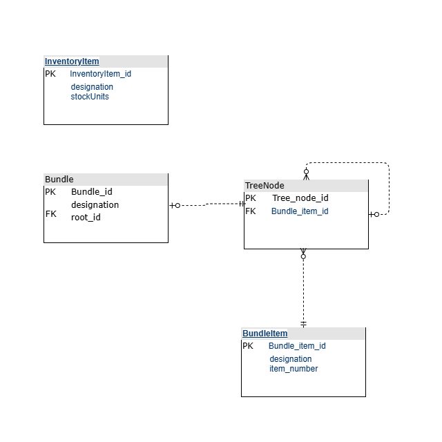
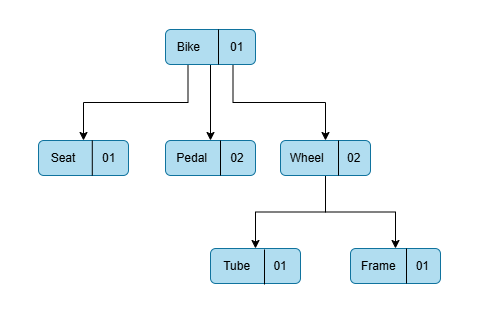

# Bundle and Inventory Management Solution

## Overview

This project is a solution to the challenge proposed by Qublex startup. The challenge involves creating a program that calculates the maximum number of bundles that can be assembled with the available stock quantity in the inventory. Additionally, it requires modeling a rational database structure and implementing it using Object-Relational Mapping (ORM).

## Technologies Used

- **Programming Language**: Java ( version 17.0.11 )
- **Framwork**: Spring Boot 
- **Database**: H2
- **ORM Framework**: Hibernate

## Features

### Part 1: Bundle Calculation Program

- **Tree Structure Representation**: The solution represents each bundle as a tree structure. Each bundle consists of various bundle items, each having a specified number required for creating one bundle.
- **Inventory Management**: The program manages an inventory of spare parts, each associated with a stock quantity.
- **Maximum Bundle Calculation**: The core functionality calculates the maximum number of bundles that can be created using the available spare parts in the inventory.

### Part 2: Rational Database Structure

- **Database Modeling**: The solution includes a rational database structure to store bundles, bundle items, and inventory details as shown in the following ERD.



- **ORM Implementation**: The database structure is implemented using Hibernate which is an Object-Relational Mapping (ORM) framework for spring boot application, ensuring seamless integration between the database and the application.

## Installation

1. **Clone the Repository**:
    ```bash
    git clone https://github.com/AmiraBelkis/Qublex-coding-challange.git
    ```
2. **Navigate to the Project Directory**:
    ```bash
    cd Qublex-coding-challange/Challenge
    ```

## Usage
- Use the provided api within the postman collection `Qublex_Coding_Challenge_Postman_Collection.json` that contain the following end-points:
### Endpoints

#### 1. Calculate the Maximum Number of Bundles

**GET** `/calculateBundleNumber`

This endpoint calculates the maximum number of bundles that can be made with the stock quantity available in the inventory.

- **URL Parameters:**
  - `designation`: The name of the bundle (e.g., `Laptop`).

- **Example Request:**

  ```http
  GET {{base_url}}/calculateBundleNumber?designation=Laptop
  ```

- **Example Response:**

  ```
  20
  ```

#### 2. Get Inventory Items List

**GET** `/inventory/inventoryItems`

This endpoint retrieves a list of all inventory items.

- **Example Request:**

  ```http
  GET {{base_url}}/inventory/inventoryItems
  ```

- **Example Response:**

  ```json
  [
    {
      "designation": "Processor",
      "stockUnits": 150
    },
    {
      "designation": "RAM",
      "stockUnits": 160
    }
  ]
  ```

#### 3. Create New Bundle

**POST** `/addBundleStructure`

This endpoint creates a new bundle structure.

- **Request Body:**

  ```json
  {
    "designation": "Laptop",
    "root": {
      "data": {
        "designation": "Laptop",
        "itemNumber": 1
      },
      "children": [
        {
          "data": {
            "designation": "Processor",
            "itemNumber": 1
          },
          "children": []
        },
        {
          "data": {
            "designation": "Motherboard",
            "itemNumber": 1
          },
          "children": [
            {
              "data": {
                "designation": "RAM",
                "itemNumber": 1
              },
              "children": []
            },
            {
              "data": {
                "designation": "Storage Drive",
                "itemNumber": 1
              },
              "children": []
            },
            {
              "data": {
                "designation": "Graphics Card",
                "itemNumber": 1
              },
              "children": []
            }
          ]
        },
        {
          "data": {
            "designation": "Screen",
            "itemNumber": 1
          },
          "children": [
            {
              "data": {
                "designation": "Display Panel",
                "itemNumber": 1
              },
              "children": []
            },
            {
              "data": {
                "designation": "Bezel",
                "itemNumber": 1
              },
              "children": []
            }
          ]
        },
        {
          "data": {
            "designation": "Battery",
            "itemNumber": 1
          },
          "children": []
        }
      ]
    }
  }
  ```

- **Example Request:**

  ```http
  POST {{base_url}}/addBundleStructure
  Content-Type: application/json

  {
    "designation": "Laptop",
    "root": {
      "data": {
        "designation": "Laptop",
        "itemNumber": 1
      },
      "children": [
        {
          "data": {
            "designation": "Processor",
            "itemNumber": 1
          },
          "children": []
        },
        {
          "data": {
            "designation": "Motherboard",
            "itemNumber": 1
          },
          "children": [
            {
              "data": {
                "designation": "RAM",
                "itemNumber": 1
              },
              "children": []
            },
            {
              "data": {
                "designation": "Storage Drive",
                "itemNumber": 1
              },
              "children": []
            },
            {
              "data": {
                "designation": "Graphics Card",
                "itemNumber": 1
              },
              "children": []
            }
          ]
        },
        {
          "data": {
            "designation": "Screen",
            "itemNumber": 1
          },
          "children": [
            {
              "data": {
                "designation": "Display Panel",
                "itemNumber": 1
              },
              "children": []
            },
            {
              "data": {
                "designation": "Bezel",
                "itemNumber": 1
              },
              "children": []
            }
          ]
        },
        {
          "data": {
            "designation": "Battery",
            "itemNumber": 1
          },
          "children": []
        }
      ]
    }
  }
  ```

- **Example Response:**

  ```json
  {
  "designation": "Laptop",
  "root": {
    "data": {
      "designation": "Laptop",
      "itemNumber": 1
    },
    "children": [
      {
        "data": {
          "designation": "Processor",
          "itemNumber": 1
        },
        "children": []
      },
      {
        "data": {
          "designation": "Motherboard",
          "itemNumber": 1
        },
        "children": [
          {
            "data": {
              "designation": "RAM",
              "itemNumber": 1
            },
            "children": []
          },
          {
            "data": {
              "designation": "Storage Drive",
              "itemNumber": 1
            },
            "children": []
          },
          {
            "data": {
              "designation": "Graphics Card",
              "itemNumber": 1
            },
            "children": []
          }
        ]
      },
      {
        "data": {
          "designation": "Screen",
          "itemNumber": 1
        },
        "children": [
          {
            "data": {
              "designation": "Display Panel",
              "itemNumber": 1
            },
            "children": []
          },
          {
            "data": {
              "designation": "Bezel",
              "itemNumber": 1
            },
            "children": []
          }
        ]
      },
      {
        "data": {
          "designation": "Battery",
          "itemNumber": 1
        },
        "children": []
      }
    ]
  } 
  }
  ```

#### 4. Insert New Inventory Items

**POST** `/inventory/addInventoryItems`

This endpoint inserts a list of new inventory items.

- **Request Body:**

  ```json
  [
    {
      "designation": "Processor",
      "stockUnits": 150
    },
    {
      "designation": "RAM",
      "stockUnits": 160
    },
    {
      "designation": "Storage Drive",
      "stockUnits": 80
    },
    {
      "designation": "Graphics Card",
      "stockUnits": 95
    },
    {
      "designation": "Display Panel",
      "stockUnits": 170
    },
    {
      "designation": "Bezel",
      "stockUnits": 340
    },
    {
      "designation": "Battery",
      "stockUnits": 70
    }
  ]
  ```

- **Example Request:**

  ```http
  POST {{base_url}}/inventory/addInventoryItems
  Content-Type: application/json

  [
    {
      "designation": "Processor",
      "stockUnits": 150
    },
    {
      "designation": "RAM",
      "stockUnits": 160
    },
    {
      "designation": "Storage Drive",
      "stockUnits": 80
    },
    {
      "designation": "Graphics Card",
      "stockUnits": 95
    },
    {
      "designation": "Display Panel",
      "stockUnits": 170
    },
    {
      "designation": "Bezel",
      "stockUnits": 340
    },
    {
      "designation": "Battery",
      "stockUnits": 70
    }
  ]
  ```

- **Example Response:**

  ```json
  [
      {
        "designation": "Processor",
        "stockUnits": 150
      },
      {
        "designation": "RAM",
        "stockUnits": 160
      },
      {
        "designation": "Storage Drive",
        "stockUnits": 80
      },
      {
        "designation": "Graphics Card",
        "stockUnits": 95
      },
      {
        "designation": "Display Panel",
        "stockUnits": 170
      },
      {
        "designation": "Bezel",
        "stockUnits": 340
      },
      {
        "designation": "Battery",
        "stockUnits": 70
      }
    ]
  ```


- **Note** : Replace `{{base_url}}` with your actual base URL. Example: `http://localhost:8080/api/`


---

### Database Initialization

The program initializes the database with the following example data:


#### Bundle Structure

```json
{
  "designation": "Bike",
  "root": {
    "data": {
      "designation": "Bike",
      "itemNumber": 1
    },
    "children": [
      {
        "data": {
          "designation": "Seat",
          "itemNumber": 1
        },
        "children": []
      },
      {
        "data": {
          "designation": "Pedal",
          "itemNumber": 2
        },
        "children": []
      },
      {
        "data": {
          "designation": "Wheel",
          "itemNumber": 2
        },
        "children": [
          {
            "data": {
              "designation": "Frame",
              "itemNumber": 1
            },
            "children": []
          },
          {
            "data": {
              "designation": "Tube",
              "itemNumber": 1
            },
            "children": []
          }
        ]
      }
    ]
  }
}
```

#### Inventory Items

```json
[
  {
    "designation": "Seat",
    "stockUnits": 50
  },
  {
    "designation": "Pedal",
    "stockUnits": 60
  },
  {
    "designation": "Frame",
    "stockUnits": 60
  },
  {
    "designation": "Tube",
    "stockUnits": 35
  }
]
```

